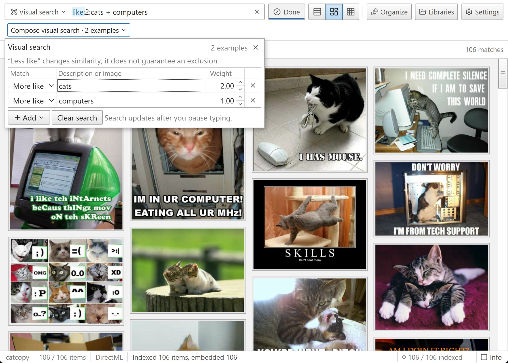
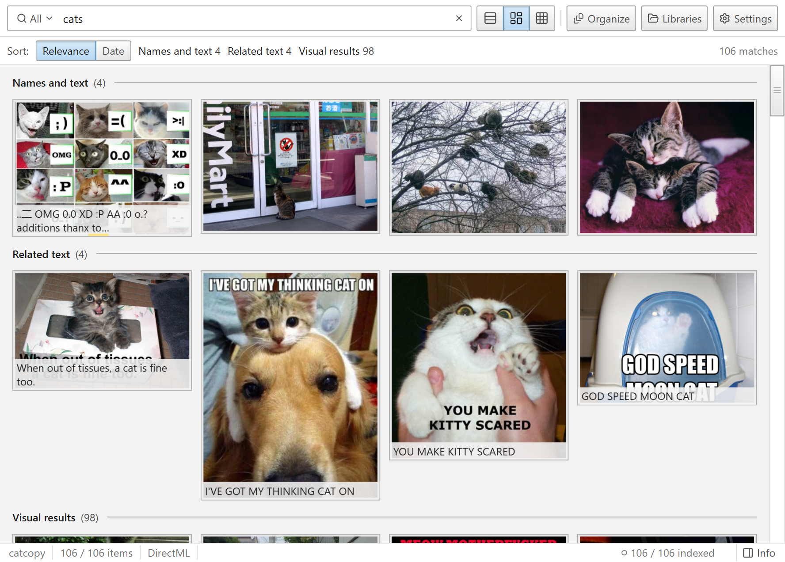
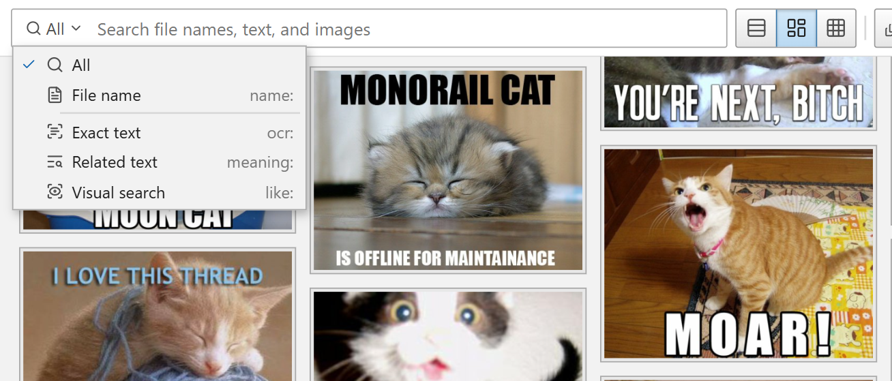

# Nicegal

nicegal is a super fast desktop gallery. it has powerful search features, and is designed to help people find stuff in gigantic unsorted downloads folders.

it supports searching the text inside images with optical character recognition (PaddleOCR), and visually searching images with CLIP. you can also search for images with other images. the OCR and CLIP search indexing uses your gpu if you have one.

- 3 different phone style gallery layouts, date navigation
- browse existing folders without moving your files.
- find exact words, related text (vecsearch), visual concepts, or similar images.
- combine descriptions and image references in one search

### Search modes:

- **All** - Show a view with all 3 of the blow.
- **Exact text `ocr:`** - Words found inside images.
- **Related text `meaning:`** - Text with a similar meaning to your query.
- **Visual search `like:`** - Appearance, concepts, and similarity to another image.

## Get Nicegal

[Downloads](https://github.com/centuryofimage/nicegal/releases)

search models download on first use. pictures are processed locally, all data remains on your computer, no telemetry.

built with svelte and a
[rust search backend](https://github.com/centuryofimage/nicegal-server), using DirectML and OpenVino thru [ort](https://ort.pyke.io/).

## Perf tips

If you have a really bad gpu, you might benefit from changing the onnx execution provider from directml to OpenVino and then restarting the application. For most users, DirectML > OpenVino > CPU.

## Special acknowledgements

This project was heavily inspired by (rclip)[https://github.com/yurijmikhalevich/rclip]. It definitely wouldn't have been possible without (ort)[https://ort.pyke.io/] and (sqlite-vec)[https://github.com/asg017/sqlite-vec].

## License

### Application licenses

The original frontend code is licensed under [MIT](LICENSE). The original backend
code is licensed under [GNU AGPL version 3 only](nicegal-server/LICENSE).
Modified third-party code in `nicegal-server/vendor/` remains Apache-2.0.
These terms do not replace separately identified component licenses. Downloaded
model weights are subject to their publishers' licenses. See [LICENSING](LICENSING).
